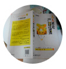

<h1>ShapeHtml</h1>
摊手- -<br/>
技术渣<br/>
用于div,image图形,省去切图,直接添加css好像也没多大用处OTZ<br/>
现有圆形和六边形,图像标签添加css<br/>
<h2>Quick Start</h2>
head头部添加jquery,shape.css,shape.js
```html
<link href="css/shape.css" rel="stylesheet"/>
<script src="http://code.jquery.com/jquery-2.1.1.js"></script>
<script src="js/shape.js"></script>
```
```html


```




<h2><a aria-hidden="true" href="#license" class="anchor" id="user-content-license"><span class="octicon octicon-link"></span></a>License</h2>
<p>Copyright (c) 2014 孙大炮(艺名)</p>
